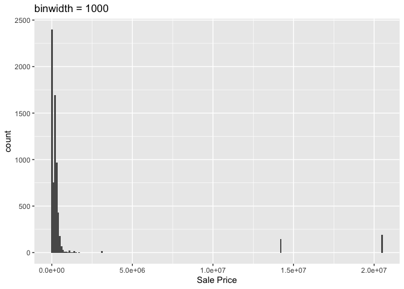

<!-- README.md is generated from README.Rmd. Please edit the README.Rmd file -->

# Lab report \#1

Follow the instructions posted at
<https://ds202-at-isu.github.io/labs.html> for the lab assignment. The
work is meant to be finished during the lab time, but you have time
until Monday evening to polish things.

Include your answers in this document (Rmd file). Make sure that it
knits properly (into the md file). Upload both the Rmd and the md file
to your repository.

All submissions to the github repo will be automatically uploaded for
grading once the due date is passed. Submit a link to your repository on
Canvas (only one submission per team) to signal to the instructors that
you are done with your submission.

### step 1 result:

(Jordyn)

``` r
library(classdata)

head(ames)
```

    ##    Parcel ID                       Address             Style
    ## 1 0903202160      1024 RIDGEWOOD AVE, AMES 1 1/2 Story Frame
    ## 2 0907428215 4503 TWAIN CIR UNIT 105, AMES     1 Story Frame
    ## 3 0909428070        2030 MCCARTHY RD, AMES     1 Story Frame
    ## 4 0923203160         3404 EMERALD DR, AMES     1 Story Frame
    ## 5 0520440010       4507 EVEREST  AVE, AMES              <NA>
    ## 6 0907275030       4512 HEMINGWAY DR, AMES     2 Story Frame
    ##                        Occupancy  Sale Date Sale Price Multi Sale YearBuilt
    ## 1 Single-Family / Owner Occupied 2022-08-12     181900       <NA>      1940
    ## 2                    Condominium 2022-08-04     127100       <NA>      2006
    ## 3 Single-Family / Owner Occupied 2022-08-15          0       <NA>      1951
    ## 4                      Townhouse 2022-08-09     245000       <NA>      1997
    ## 5                           <NA> 2022-08-03     449664       <NA>        NA
    ## 6 Single-Family / Owner Occupied 2022-08-16     368000       <NA>      1996
    ##   Acres TotalLivingArea (sf) Bedrooms FinishedBsmtArea (sf) LotArea(sf)  AC
    ## 1 0.109                 1030        2                    NA        4740 Yes
    ## 2 0.027                  771        1                    NA        1181 Yes
    ## 3 0.321                 1456        3                  1261       14000 Yes
    ## 4 0.103                 1289        4                   890        4500 Yes
    ## 5 0.287                   NA       NA                    NA       12493  No
    ## 6 0.494                 2223        4                    NA       21533 Yes
    ##   FirePlace              Neighborhood
    ## 1       Yes       (28) Res: Brookside
    ## 2        No    (55) Res: Dakota Ridge
    ## 3        No        (32) Res: Crawford
    ## 4        No        (31) Res: Mitchell
    ## 5        No (19) Res: North Ridge Hei
    ## 6       Yes   (37) Res: College Creek

The variables included in the data set are Parcel ID (Categorical),
Address (Categorical), Style (Categorical), Occupancy (Categorical),
Sale Date (Categorical), Sale Price (Quantitative), Multi Sale
(Categorical), Year Built (Categorical), Acres (Quantitative), Total
Living Area (Quantitative), Bedrooms (Quantitative), Finished Basement
Area (Quantitative), Lot Area (Quantitative), AC (Categorical),
Fireplace (Categorical), Neighborhood (Categorical). Each variable
represents a factor in the pricing of a home. We expect the ranges of
the large variables to be in the thousands.

### step 2 result:

A variable that could be of special interest for this data set is Sale
Price.

### step 3 result:Ashlynn

``` r
library(ggplot2)
ggplot(ames, aes(x = `Sale Price`)) + 
  geom_histogram(binwidth=100000) +
  ggtitle("binwidth = 1000")
```

<!-- -->

### step 4 result:

Jordyn’s work:

I chose to compare the Lot Area against Sale Price to see if there were
any relationships between the two.

``` r
library(ggplot2)
ggplot(data = ames, aes(x = `LotArea(sf)`, y = `Sale Price`)) +
  geom_point() +
  geom_smooth(method = "lm", se = FALSE)
```

    ## `geom_smooth()` using formula = 'y ~ x'

    ## Warning: Removed 89 rows containing non-finite outside the scale range
    ## (`stat_smooth()`).

    ## Warning: Removed 89 rows containing missing values or values outside the scale range
    ## (`geom_point()`).

<!-- -->

After plotting the data it is clear that there is really no relationship
between the two variables. The graph was linear, negative, and had no
correlation. There were several outliers, some in the y direction and
some in the x direction. The range of lot area is 0 sf to 1,028 sf. I
don’t think that this pattern really explains any odd findings in the
data, as there was no correlation.

Ashlynn’s work:

Eitan’s work:

Ethan’s work: I chose to compare Year Built against the special interest
variable of Sale Price.
