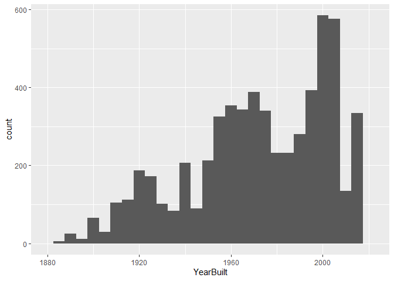

<!-- README.md is generated from README.Rmd. Please edit the README.Rmd file -->

# Lab report \#1

Follow the instructions posted at
<https://ds202-at-isu.github.io/labs.html> for the lab assignment. The
work is meant to be finished during the lab time, but you have time
until Monday evening to polish things.

Include your answers in this document (Rmd file). Make sure that it
knits properly (into the md file). Upload both the Rmd and the md file
to your repository.

All submissions to the github repo will be automatically uploaded for
grading once the due date is passed. Submit a link to your repository on
Canvas (only one submission per team) to signal to the instructors that
you are done with your submission.

### step 1 result:

### step 2 result:

Ethan: A variable that could be of special interest for this data set is
Sale Price.

### step 3 result:

abc

### step 4 result:

Jordyn’s work:

Ashlynn’s work:

Eitan’s work:

Ethan’s work: I chose to compare Year Built against the special interest
variable of Sale Price. The range of this variable is from 1880 - 2022
(with on line showing 0 as a the year built indicating an error in
entering of the data) Below is the histogram plot of the variable
“YearBuilt”. The pattern shows the majority of the houses were built in
the late 1990’s and early 2000’s, but besides the one outlier at 0 the
data shows a bell curve that may be skewed left a bit.

``` r
library(classdata)
#the below code shows how I found the range of the variable "YearBuilt"
range(ames$YearBuilt, na.rm = T)
```

    ## [1]    0 2022

``` r
library(ggplot2)
#this code shows a histogram of the "YearBuilt" variable with a bandwidth of 5 to show the differences in years between the data. The x axis values were wide because there is one house at 0 due to incorrect entering of data, so a limit was added to the x axis to make the data more readable. 
ggplot(ames, aes(x=YearBuilt)) + geom_histogram(binwidth = 5) + scale_x_continuous(limits = c(1880,2022))
```

    ## Warning: Removed 448 rows containing non-finite outside the scale range
    ## (`stat_bin()`).

    ## Warning: Removed 2 rows containing missing values or values outside the scale range
    ## (`geom_bar()`).

<!-- --> After
plotting just the “YearBuilt” variable, I plotted it against the special
variable of interest “SalePrice”. Below is the scatterplot of the two
variables. A limit was added to both of the axes in order to make the
plot readable in a sense. The y limit removed 1 outlier where the
“YearBuilt” variable was 0, and the x limit removed two sets of outliers
where the “SalePrice” was 20,000,000 and 14,000,000. From this graph,
you can identify somewhat of a positive correlation, but not a strong
one as data points are everywhere. An interesting oddity would be at the
y axis, where there are a bunch of points ranging from all years where
the “SalePrice” was 0. This plot still shows the oddities of the main
variable from step 3 as it shows points at 0 on the y axis, but it does
not show the outlier oddities that were removed from this graph to make
it readable. Overall, this plot has an unclear shape as points are
scattered all over, unclear pattern as there is no slope for the line of
best fit, weak strength as there is very little clustering between
points, and a very wide spread.

``` r
#this is code for the scatterplot shown below comparing the two variables "SalePrice" and "YearBuilt". A limit was added to both of the axes in order to make the plot readable in a sense.Geom_smooth adds a line of best fit, although it is has no slope. 
ggplot(ames, aes(x=`Sale Price`, y=YearBuilt)) + geom_point() + scale_y_continuous(limits = c(1880,2022)) + scale_x_continuous(limits = c(0,306000)) +  geom_smooth(method = "lm", se = FALSE)
```

    ## `geom_smooth()` using formula = 'y ~ x'

    ## Warning: Removed 1782 rows containing non-finite outside the scale range
    ## (`stat_smooth()`).

    ## Warning: Removed 1782 rows containing missing values or values outside the scale range
    ## (`geom_point()`).

<!-- -->
